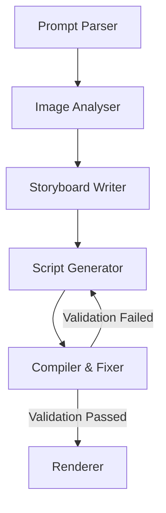

# AI Video Generation Pipeline (LangGraph + Remotion)

This project is an autonomous multi-agent system orchestrated using LangGraph. It dynamically generates a fully runnable React-based Remotion video script based on a text prompt and a batch of event photos. I built this pipeline to focus heavily on fault tolerance, clean architectural routing, and structured data handling.

## Key Architectural Features

* 
**Self-Healing Compiler Loop:** Before rendering, a Compiler and Fixer node tests the generated React script for syntax errors.

* If an error is caught, the agent fetches the exact Remotion API documentation needed via RAG, packages the error context, and loops back to rewrite its own code dynamically.

* 
**Multi-Model Cost and Quality Routing:** The graph optimizes production economics by routing simple narrative structuring to a fast, cost-effective model (Llama 3.1 8B), while reserving the heavy-duty code generation for a massive 70B model (Llama 3.3 70B).

* 
**Zero Free-Text Parsing:** Every single step of the pipeline uses strict Pydantic schemas to enforce structured JSON outputs, eliminating reliance on messy string parsing.

* 
**LLM-as-Judge Evaluation:** The testing suite includes a programmatic AI judge to evaluate the narrative coherence of the generated storyboards offline.

---

## Setup and Run Instructions

**Prerequisites**

* Python 3.11+: Required for full compatibility with Pydantic and LangGraph dependencies.

* Node.js: Required to compile and run the final Remotion video dependencies.

**Installation and Configuration**

* Clone the repository and install the strictly pinned dependencies by running `pip install -r requirements.txt`.

* Copy the `.env.example` file to create a new `.env` file.

* Add your Groq API key (`GROQ_API_KEY=gsk_...`) to this file.

* Because this is a local command-line application, drop your batch of event photos (8-12 images) into the designated `/images` or `/data` folder in the project root.

* The Vision LLM will automatically analyze these files.

**Execution**

* To run the autonomous agent loop, execute `python -m src.graph` in your terminal.

* To run the offline evaluation and mock testing suite (which triggers the LLM-as-Judge evaluation), run `pytest tests/ -v -s`.

---

## LangGraph Architecture Diagram

The pipeline orchestrates a highly structured sequence of AI agents that share a central state object (GraphState).

---

## Model Selection Rationale

This pipeline optimizes production economics through deliberate multi-model routing. Groq was selected as the provider to leverage its lightning-fast inference speeds for multi-agent execution.

* 
**Storyboard Writer (Llama 3.1 8B):** Simple narrative structuring tasks are routed to a fast, cost-effective 8B model.

* Organizing a narrative arc and timing is a straightforward text-processing task that does not require massive parameter counts.

* 
**Script Generator (Llama 3.3 70B):** Complex code generation is strictly reserved for a heavy-duty 70B model.

* Writing syntactically correct, runnable Remotion code requires advanced reasoning and high output quality.

---

## RAG Design Decisions

The Retrieval-Augmented Generation (RAG) layer is critical for providing the agents with the specific context they need to generate accurate outputs.

* 
**Vector Store and Collections:** The system uses a local vector store (like Chroma or Qdrant) seeded with two distinct types of documents: short style guides describing visual treatments and Remotion API reference snippets.

* 
**Chunking Strategy:** Different chunking strategies are utilized for the two document types.

* Prose (style guides) and code (API snippets) require fundamentally different approaches for optimal retrieval.

* 
**Retrieval Approach:** The Storyboard Writer retrieves visual style context before sequencing the narrative.

* The Script Generator retrieves standard API context before drafting code.

* During the self-healing loop, the Compiler dynamically retrieves the highly specific Remotion API snippet most relevant to the exact error caught.

---

## Known Limitations

* 
**Strict Output Formats:** Every step of the graph uses strict Pydantic schemas to enforce structured JSON outputs.

* However, small LLMs occasionally hallucinate keys outside of the strict schema constraints.

* The pipeline mitigates this through LangChain's `.with_structured_output()`, but edge-case prompt injections can still break the parser.

* 
**Rate Limiting:** Free-tier Groq API keys may occasionally hit Tokens-Per-Minute (TPM) limits during the self-healing retry loop.

* This typically occurs if the generated error context passed back to the Script Generator is exceptionally large.
