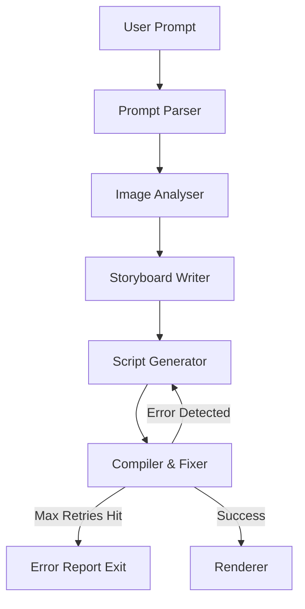

#  AI Video Generation Agent (Foto Owl AI)

A multi-agent LangGraph orchestration pipeline that autonomously generates highly stylized, runnable Remotion (React) video scripts from raw event photos and user prompts. 

Built as a submission for the Foto Owl AI Engineering Internship.

## Architecture & Multi-Agent Routing

This project utilizes a self-healing LangGraph architecture consisting of five core nodes:
1. **Prompt Parser**: Extracts a structured `VideoIntent` (pacing, style, transitions).
2. **Image Analyser (Vision)**: Selects the most relevant event photos based on the intent.
3. **Storyboard Writer**: Constructs a cohesive narrative arc and sequences the images.
4. **Script Generator**: Writes a complete, runnable Remotion composition in React.
5. **Compiler & Fixer**: Actively validates the generated code. If it fails, it fetches targeted API documentation via RAG and routes the error back to the Script Generator for a self-healing fix.


---

## Engineering Decisions

### Model Selection (Cost/Quality Tradeoff)
To optimize for both speed and advanced reasoning, this pipeline utilizes dynamic multi-model routing via Groq:
* **Llama 3.1 8B (Instant)**: Used for the Storyboard Writer. Structuring a narrative is a straightforward text-processing task, making this fast, cost-effective model ideal.
* **Llama 3.3 70B (Versatile)**: Used for the Script Generator. Writing syntactically correct React/Remotion code requires deep reasoning and high-quality output, necessitating a heavy-duty model.

### RAG Implementation
A local vector store is utilized to provide targeted context to the generative agents. It contains two distinct document types:
* **Style Guides**: Prose descriptions of visual treatments (e.g., "cinematic", "energetic") used by the Storyboard Writer.
* **API Documentation**: Code snippets of the Remotion API used by the Compiler & Fixer to teach the LLM how to resolve specific React syntax errors dynamically.

---

## Setup & Installation Instructions

**Prerequisites:**
* Python 3.11+
* Node.js (Required for rendering the final Remotion video)

**1. Clone the Repository**
```bash
git clone [https://github.com/yourusername/Intern-Project.git](https://github.com/yourusername/Intern-Project.git)
cd Intern-Project
```
**2. Set Up the Python Environment**
```
python -m venv venv
# Windows
venv\Scripts\activate
# Mac/Linux
source venv/bin/activate

pip install -r requirements.txt
```
**3. Configure Environment Variables**
```
cp .env.example .env
```
**Running the Pipeline**
```
python -m src.graph
```

**To run the offline evaluation and mock testing suite:**
```
pytest tests/ -v -s
```
